# 🏗️ AI SALES AUTOMATION - ARCHITECTURE DIAGRAMS

## 1. SYSTEM FLOW DIAGRAM

## 2. FILE DEPENDENCIES DIAGRAM

## 3. DATA FLOW - AUTO REPLY SEQUENCE

## 4. DATA FLOW - AGENT ASSIST SEQUENCE

## 5. BOT/HUMAN MODE STATE MACHINE

## 6. DATABASE SCHEMA FLOW

```mermaid
graph TD
    Company[Company<br/>name<br/>telegramBotToken] -->|owns| User[User<br/>email<br/>role<br/>companyId]
    Company -->|owns| Lead[Lead<br/>contact<br/>channel<br/>companyId]
    Company -->|owns| Conversation[Conversation<br/>leadId<br/>mode:BOT/HUMAN<br/>channel<br/>companyId]
    
    Lead -->|has many| Conversation
    Conversation -->|has many| Message[Message<br/>content<br/>sender:CLIENT/AGENT/SYSTEM<br/>conversationId<br/>createdAt]
    
    Message -->|role mapping| OpenAI["OpenAI Format<br/>CLIENT → user<br/>AGENT → assistant<br/>SYSTEM → assistant"]
```

## 7. AI PROMPTS ARCHITECTURE

## 8. API ENDPOINT ARCHITECTURE

```mermaid
graph LR
    A[Express Router] -->|GET /conversations| B["Fetch All<br/>Conversations"]
    A -->|GET /conversations/:id/messages| C["Fetch Messages"]
    A -->|GET /conversations/:id/suggest-reply| D["🤖 Suggest Reply<br/>Agent-Assist"]
    A -->|GET /conversations/:id/summary| E["🧠 Summarize<br/>Agent-Assist"]
    A -->|PUT /conversations/:id| F["Toggle Mode<br/>BOT/HUMAN"]
    
    B -->|requires| G[authMiddleware]
    C -->|requires| G
    D -->|requires| G
    E -->|requires| G
    F -->|requires| G
```

## 9. ERROR HANDLING FLOW

## 10. TEMPERATURE & CREATIVITY SPECTRUM

```mermaid
graph LR
    A["🔴 0.0<br/>Most Focused<br/>Deterministic"] -->|"↑ Creativity"| B["0.3-0.4<br/>Sales Mode<br/>Controlled"]
    B -->|↑| C["0.5-0.6<br/>Balanced<br/>Natural"]
    C -->|↑| D["0.8-1.0<br/>🟢 Most Creative<br/>Unpredictable"]
    
    B -.->|"✅ Used by<br/>generateSalesReply"| E["Sales automation<br/>consistency matters"]
    C -.->|"Used by<br/>suggestAgentReply"| F["Suggestions need<br/>some variety"]
```

## 11. MESSAGE LIFECYCLE

## 12. DEPLOYMENT TOPOLOGY

---

## Summary

These diagrams show:
1. **End-to-end flow** from customer message to AI reply
2. **File dependencies** and module relationships
3. **Sequence diagrams** for both auto-reply and agent-assist
4. **State machine** for BOT/HUMAN mode switching
5. **Database schema** and relationships
6. **Prompt layering** architecture
7. **API endpoint** structure
8. **Error handling** paths
9. **Creativity spectrum** for temperature settings
10. **Message lifecycle** tracking
11. **Production deployment** topology

All components work together to create a scalable, maintainable AI sales automation system.
